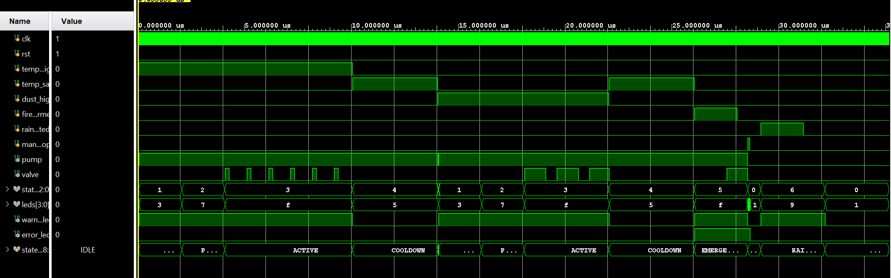

# Naga-1.2-showcase

# Naga 1.2 — Autonomous Solar Panel Cooling & Cleaning System

**A hybrid FPGA + embedded system that autonomously cools, cleans, and safeguards rooftop solar panels in hot, dusty climates.**

---

## Overview

Rooftop solar panels in tropical climates lose efficiency to two constant enemies: **heat** (efficiency drops as panels rise above their rated temperature) and **dust** (soiling blocks incident sunlight). Manual cleaning is infrequent and labour-intensive, and rooftop installations carry a real, often-unseen risk of fire.

**Naga 1.2** addresses all three autonomously. It senses the conditions that matter, decides when action is genuinely worthwhile, and drives a water-based cooling/cleaning system — all without human intervention or a cloud connection.

---

## Architecture

Naga 1.2 uses a **heterogeneous FPGA + microcontroller design**, assigning each task to the processor architecturally suited to it:

```
   Sensors (RS-485 / Modbus)                
            │                                        
            ▼                                        
   ┌─────────────────────┐   condition flags   ┌──────────────┐
   │      ESP32-S3        │ ──────────────────► │   FPGA       │
   │  sensing · decisions │      (GPIO)         │  Arty S7-25  │
   │  dashboard · logging │ ◄────────────────── │  control FSM │
   └─────────────────────┘    state readback    └──────────────┘
            │                                            │
            ▼                                            ▼
     Web Dashboard (WiFi)                         Solid-State Relays
                                                  Pump · Valve
```

**Detection = ESP32. Response = FPGA.**

| Layer | Processor | Responsibility |
|-------|-----------|----------------|
| **Sensing & Intelligence** | ESP32-S3 | Reads sensors, runs detection & cost-benefit logic, serves dashboard, logs, connectivity |
| **Real-Time Control** | Arty S7-25 (Spartan-7) | Runs the actuation FSM in dedicated hardware, providing deterministic pump/valve control independent of MCU task scheduling once a condition flag is asserted. |

This separation keeps timing-critical actuation logic in dedicated hardware, so execution does not depend on the microcontroller’s other software tasks once an actuation condition has been issued.
---

## Key Engineering

### Digital Design (FPGA / RTL)
- Control **finite state machine** implemented in **Verilog**, deployed on a Xilinx Spartan-7 FPGA
- **Verified in simulation** (testbench + waveform analysis) before hardware deployment
- **Pulse-based spray control** — evaporative cooling bursts vs. flow-based cleaning, timed entirely in hardware
- Priority-driven safety overrides (fire → emergency response, always highest priority)

### Industrial Sensing (RS-485 / Modbus-RTU)
Naga 1.2 upgrades to a suite of **industrial-grade RS-485 sensors** sharing a single Modbus bus, each contributing to the system's decisions:

| Sensor | Measures | Its job in the system |
|--------|----------|-----------------------|
| **Solar irradiance** | Incident solar energy (W/m²) | Measures incident solar irradiance and provides an input for estimating potential recoverable energy, helping suppress unnecessary actuation when available solar input is low, such as at night or under heavy cloud. |
| **Temperature / Humidity** | Air temperature & relative humidity (radiation-shielded) | Provides environmental context that can be used to suppress unnecessary actuation under changing weather conditions. Rising humidity together with falling temperature can indicate conditions consistent with incoming rain and can therefore contribute to a decision to hold off spraying. |
| **PM2.5 / PM10** | Airborne particulate concentration (µg/m³) |Measures airborne particulate concentration and provides an input/proxy for the system’s cleaning and hazard-detection logic. |
| **Energy meter** | Voltage, current, power & energy (kWh) | Measures real electrical output, grounding the cost-benefit engine in actual generated power rather than estimates alone and enabling true energy monitoring |

- Custom **Modbus-RTU** implementation with CRC-16 validation, frame synchronisation, echo handling, and automatic retries
- Robust against bus turnaround noise and marginal connections

### Edge Decision Logic
- On-device **cost-benefit engine** — estimates recoverable energy (from live irradiance + panel temperature) against the water and pump-energy cost of a cycle
- The system actuates **only when it's genuinely worthwhile**, scaling with real-time solar conditions

### Hazard Detection *(patent-pending)*
- A **gradient / trend-analysis layer** examines how conditions change over time to distinguish genuine hazards from ordinary environmental variation
- *(Method details withheld — patent-pending)*

### Power & Hardware
- Mains-derived **24 V / 5 V / 3.3 V** rails with protected conversion
- **Solid-state relay** switching with inductive-load (flyback) protection
- Designed to run **headless** from mains, both boards booting autonomously from flash

### Connectivity
- Locally served **web dashboard** (HTML/CSS/JS) over WiFi — live readings, system state, and manual controls
- Event logging with real-time (NTP-synced) timestamps — no cloud dependency

---

## Tech Stack

**Hardware:** Xilinx Spartan-7 FPGA (Arty S7-25) · ESP32-S3 · RS-485 industrial sensors · solid-state relays · 24 V pump & solenoid valve

**Languages & Tools:** Verilog (Vivado) · MicroPython · Modbus-RTU · HTML/CSS/JavaScript

**Domains:** Digital design / RTL · Embedded systems · Power electronics · Industrial communication · Edge computing

---

## System Behaviour

| Condition | Response |
|-----------|----------|
| Panel temperature high (and worthwhile) | Evaporative cooling — pulsed spray |
| Dust accumulation high (and worthwhile) | Cleaning — flow-based rinse |
| Fire signature detected | Emergency response (highest priority) |
| Rain detected / incoming | Spraying suspended — nature does the work |
| Manual stop | Immediate safe shutdown |

---

## Project Status

End-to-end physical integration and spray validation completed — 17 September 2026.

### FSM Verification (Simulation)

*Behavioral simulation in Vivado confirming state transitions, pulse-spray 
timing, and safety overrides — verified before hardware deployment.*

---

## Intellectual Property

Aspects of the Naga 1.2 system, in particular its hazard-detection method, are the subject of a **pending petty patent**. This repository is provided as a technical showcase; all rights in the underlying invention are reserved by the author.
Thai petty patent application no. 2603003908, filed 27 August 2026 — pending

---

*Naga 1.2 · Chawanwit Phrutnimit · University of Bath*
